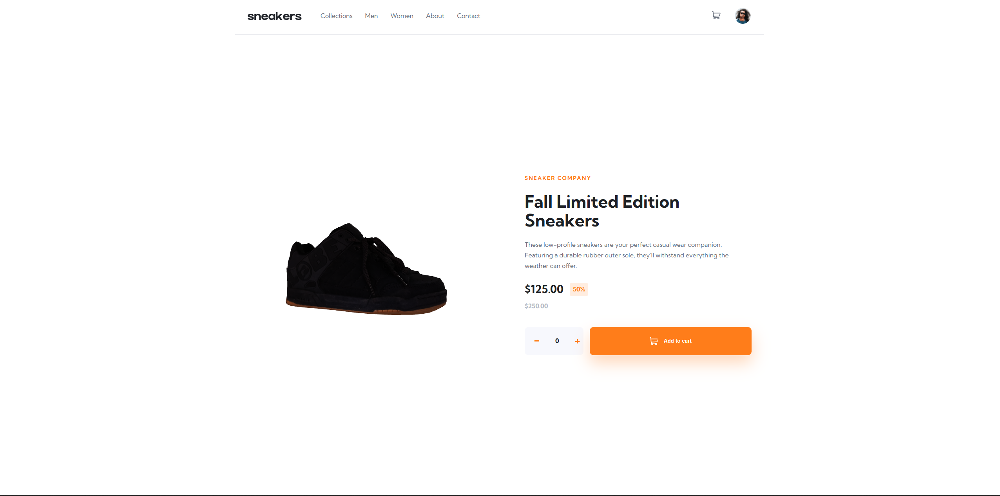

# Frontend Mentor - E-commerce product page solution

This is a solution to the [E-commerce product page challenge on Frontend Mentor](https://www.frontendmentor.io/challenges/ecommerce-product-page-UPsZ9MJp6). 

## Table of contents

- [Overview](#overview)
  - [The challenge](#the-challenge)
  - [Links](#links)
- [My process](#my-process)
  - [Built with](#built-with)
  - [What I learned](#what-i-learned)
  - [Continued development](#continued-development)
  - [Useful resources](#useful-resources)
- [Author](#author)

## Overview

### The challenge

Users should be able to:

- View the optimal layout for the site depending on their device's screen size
- See hover states for all interactive elements on the page
- View a 3D interactive sneaker model (enhanced from original challenge)
- Add items to the cart
- View the cart and remove items from it
### Screenshot


*Interactive 3D sneaker viewer built with Three.js*

### Links

- Live Site URL: [(https://e-commerce-product-page-3d.netlify.app)]


## My process

### Built with

- Semantic HTML5 markup
- CSS custom properties
- Flexbox
- CSS Grid
- Vanilla JavaScript
- Three.js r128 for 3D rendering
- GLTFLoader for 3D model loading
- OrbitControls for camera interaction
- Google Fonts (Kumbh Sans)
- Mobile-first responsive design

### What I learned

This project was my first experience with Three.js and 3D web graphics. Key learnings included:

**Three.js fundamentals:**
- Understanding the core concepts: Scene, Camera, Renderer, and the render loop
- Working with different types of lights (ambient, directional) to create realistic lighting
- Using OrbitControls to enable user interaction with the 3D model
- Loading and optimizing external 3D models (.glb format)

**3D model optimization:**
- Learned to use gltf-pipeline CLI to compress 3D models
- Reduced model size from 34MB to 1.4MB using texture compression
- Understanding the trade-offs between file size and visual quality

**Key code implementations:**

Setting up the Three.js scene:
```javascript
const scene = new THREE.Scene();
const camera = new THREE.PerspectiveCamera(50, width/height, 0.1, 1000);
const renderer = new THREE.WebGLRenderer({ antialias: true });
```

Loading and centering the 3D model:
```javascript
loader.load('./optimized.glb', function(gltf) {
  const model = gltf.scene;
  const box = new THREE.Box3().setFromObject(model);
  const center = box.getCenter(new THREE.Vector3());
  const size = box.getSize(new THREE.Vector3());
  const maxDim = Math.max(size.x, size.y, size.z);
  const scale = 2 / maxDim;
  model.scale.multiplyScalar(scale);
  model.position.sub(center.multiplyScalar(scale));
  scene.add(model);
});
```

Cart functionality with state management:
```javascript
let cart = [];
function updateCart() {
  const totalItems = cart.reduce((sum, item) => sum + item.quantity, 0);
  // Update UI based on cart state
}
```

### Continued development

Areas I want to continue focusing on:

- **Three.js advanced features**: Shadows, post-processing effects, animations
- **Performance optimization**: Implementing LOD (Level of Detail), lazy loading
- **3D model creation**: Learning Blender to create and optimize custom models
- **Lighting techniques**: Understanding PBR materials and realistic rendering
- **Responsive 3D**: Better handling of 3D scenes on mobile devices

### Useful resources

- [Three.js Documentation](https://threejs.org/docs/) - Essential reference for all Three.js concepts
- [gltf-pipeline](https://github.com/CesiumGS/gltf-pipeline) - CLI tool for optimizing GLTF/GLB models
- [Sketchfab](https://sketchfab.com/) - Finding free 3D models for web projects
- [Three.js Journey](https://threejs-journey.com/) - Comprehensive Three.js course (recommended for deep learning)
- [Frontend Mentor](https://www.frontendmentor.io) - Practice building realistic projects

## Author

- Frontend Mentor - [@Paulochonnn](https://www.frontendmentor.io/profile/Paulochonnn)

---

**Note**: This project replaces the traditional image gallery with an interactive 3D model viewer, providing a more immersive product viewing experience.